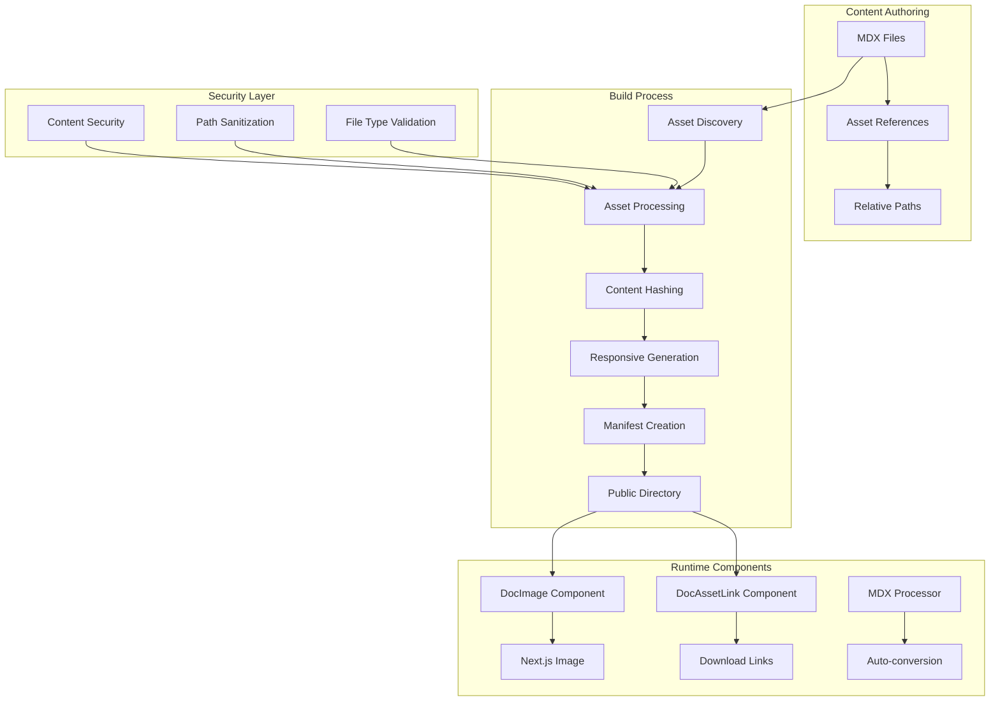

# Design Document

## Overview

The static asset management system provides a comprehensive solution for hosting, serving, and optimizing images and binary resources in an MDX-driven documentation site. The system integrates seamlessly with the existing Next.js architecture, content processing pipeline, and build system to deliver secure, performant, and developer-friendly asset handling.

The design follows a build-time processing approach where assets are discovered, processed, optimized, and catalogued during the build phase, with runtime components providing seamless integration with MDX content. This approach ensures optimal performance, security, and maintainability while supporting the existing multilingual and multi-version content structure.

## Architecture

### High-Level Architecture



### Component Architecture

The system consists of four main architectural layers:

1. **Asset Processing Layer**: Handles discovery, validation, optimization, and manifest generation
2. **Security Layer**: Provides file type validation, path sanitization, and security controls
3. **Component Layer**: React components for seamless MDX integration
4. **Integration Layer**: MDX processor extensions for automatic conversion

## Components and Interfaces

### Asset Processing Engine

**AssetProcessor Class**
```typescript
interface AssetProcessor {
  discoverAssets(contentDir: string): Promise<AssetReference[]>
  processAsset(asset: AssetReference): Promise<ProcessedAsset>
  generateManifest(assets: ProcessedAsset[]): AssetManifest
  validateAsset(filePath: string): ValidationResult
}

interface AssetReference {
  sourcePath: string
  relativePath: string
  locale: string
  version: string
  type: AssetType
  referencedBy: string[]
}

interface ProcessedAsset extends AssetReference {
  publicPath: string
  hashedFilename: string
  contentHash: string
  fileSize: number
  mimeType: string
  dimensions?: ImageDimensions
  derivatives?: AssetDerivative[]
}
```

**Image Optimization Engine**
```typescript
interface ImageOptimizer {
  generateResponsiveVariants(image: ProcessedAsset): Promise<AssetDerivative[]>
  convertToModernFormats(image: ProcessedAsset): Promise<AssetDerivative[]>
  optimizeImage(imagePath: string, options: OptimizationOptions): Promise<Buffer>
}

interface AssetDerivative {
  variant: string // '@1x', '@2x', 'webp', 'avif'
  publicPath: string
  hashedFilename: string
  fileSize: number
  dimensions?: ImageDimensions
}
```

### Security and Validation

**Security Validator**
```typescript
interface SecurityValidator {
  validateFileType(filePath: string): boolean
  sanitizePath(path: string): string
  checkFileSize(filePath: string): boolean
  scanForMaliciousContent(filePath: string): Promise<boolean>
}

interface ValidationResult {
  isValid: boolean
  errors: string[]
  warnings: string[]
  sanitizedPath?: string
}
```

**Allowed File Types Configuration**
```typescript
const ALLOWED_IMAGE_TYPES = [
  'image/jpeg', 'image/png', 'image/webp', 'image/avif', 
  'image/gif', 'image/svg+xml'
]

const ALLOWED_BINARY_TYPES = [
  'application/pdf', 'application/zip', 'application/json',
  'text/plain', 'text/csv', 'application/vnd.ms-excel'
]

const MAX_FILE_SIZE = 10 * 1024 * 1024 // 10MB
const MAX_IMAGE_DIMENSIONS = { width: 4000, height: 4000 }
```

### React Components

**DocImage Component**
```typescript
interface DocImageProps {
  src: string
  alt: string
  width?: number
  height?: number
  priority?: boolean
  className?: string
  sizes?: string
  placeholder?: 'blur' | 'empty'
}

interface DocAssetLinkProps {
  src: string
  children?: React.ReactNode
  download?: boolean | string
  className?: string
  showMetadata?: boolean
}
```

### Asset Manifest

**Manifest Structure**
```typescript
interface AssetManifest {
  version: string
  generatedAt: string
  assets: Record<string, ManifestEntry>
  locales: string[]
  versions: string[]
}

interface ManifestEntry {
  publicPath: string
  hashedFilename: string
  contentHash: string
  originalPath: string
  fileSize: number
  mimeType: string
  locale: string
  version: string
  dimensions?: ImageDimensions
  derivatives?: Record<string, AssetDerivative>
  metadata: AssetMetadata
}

interface AssetMetadata {
  lastModified: string
  referencedBy: string[]
  optimized: boolean
  securityScanned: boolean
}
```

## Data Models

### File System Organization

```
/public/assets/
├── en/
│   └── v1/
│       ├── images/
│       │   ├── screenshot.a1b2c3d4.webp
│       │   ├── screenshot.a1b2c3d4@2x.webp
│       │   └── diagram.e5f6g7h8.svg
│       └── files/
│           ├── guide.i9j0k1l2.pdf
│           └── data.m3n4o5p6.csv
├── es/
│   └── v1/
│       └── images/
│           └── captura.q7r8s9t0.webp
└── assets-manifest.json
```

### Content Directory Structure

```
/content/
├── en/
│   └── v1/
│       ├── assets/
│       │   ├── images/
│       │   │   ├── screenshot.png
│       │   │   └── diagram.svg
│       │   └── files/
│       │       ├── guide.pdf
│       │       └── data.csv
│       └── docs/
│           └── getting-started.mdx
└── es/
    └── v1/
        ├── assets/
        │   └── images/
        │       └── captura.png
        └── docs/
            └── comenzando.mdx
```

### Build Integration

The asset processing integrates with the existing build system through:

1. **Pre-build Hook**: Asset discovery and processing occurs before Next.js build
2. **Manifest Generation**: Creates `assets-manifest.json` for runtime resolution
3. **Public Directory Population**: Copies processed assets to `/public/assets/`
4. **Build Optimization**: Integrates with existing `build-optimized.ts` script

## Error Handling

### Asset Processing Errors

```typescript
enum AssetErrorType {
  FILE_NOT_FOUND = 'FILE_NOT_FOUND',
  INVALID_FILE_TYPE = 'INVALID_FILE_TYPE',
  FILE_TOO_LARGE = 'FILE_TOO_LARGE',
  PROCESSING_FAILED = 'PROCESSING_FAILED',
  SECURITY_VIOLATION = 'SECURITY_VIOLATION'
}

interface AssetError {
  type: AssetErrorType
  message: string
  filePath: string
  details?: any
}
```

### Runtime Error Handling

- **Missing Assets**: Graceful fallback with placeholder images
- **Loading Failures**: Skeleton loaders and retry mechanisms
- **Invalid References**: Clear error messages in development
- **Security Violations**: Immediate rejection with audit logging

### Development vs Production Behavior

**Development Mode:**
- Detailed error messages and warnings
- Asset processing on-demand for faster iteration
- Hot reloading support for asset changes
- Validation warnings in console

**Production Mode:**
- Graceful fallbacks for missing assets
- Optimized asset delivery with CDN support
- Security-focused error handling
- Performance monitoring integration

## Testing Strategy

### Unit Testing

1. **Asset Processing Tests**
   - File discovery and validation
   - Content hashing consistency
   - Image optimization quality
   - Manifest generation accuracy

2. **Security Tests**
   - File type validation
   - Path traversal prevention
   - Malicious content detection
   - Size limit enforcement

3. **Component Tests**
   - DocImage rendering with various props
   - DocAssetLink functionality
   - Error state handling
   - Accessibility compliance

### Integration Testing

1. **Build Process Tests**
   - End-to-end asset processing
   - Manifest generation and consumption
   - Multi-locale/version handling
   - Build performance impact

2. **MDX Integration Tests**
   - Automatic conversion accuracy
   - Backward compatibility
   - Performance impact on content processing
   - Error handling in content pipeline

### Performance Testing

1. **Asset Processing Performance**
   - Large file handling
   - Batch processing efficiency
   - Memory usage optimization
   - Build time impact measurement

2. **Runtime Performance**
   - Image loading optimization
   - Component render performance
   - Manifest lookup efficiency
   - Cache effectiveness

### Security Testing

1. **File Upload Security**
   - Malicious file detection
   - File type spoofing prevention
   - Path traversal attack prevention
   - Content scanning effectiveness

2. **Runtime Security**
   - Asset serving security headers
   - URL manipulation prevention
   - Access control validation
   - Audit trail verification

## Implementation Phases

### Phase 1: Core Asset Processing
- Asset discovery and validation engine
- Basic content hashing and manifest generation
- Security validation framework
- Integration with existing build system

### Phase 2: Image Optimization
- Sharp integration for image processing
- Responsive variant generation
- Modern format conversion (WebP, AVIF)
- Performance optimization

### Phase 3: React Components
- DocImage component with Next.js Image integration
- DocAssetLink component with metadata display
- Error handling and fallback mechanisms
- Accessibility compliance

### Phase 4: MDX Integration
- Automatic conversion of Markdown syntax
- Backward compatibility preservation
- Content processing pipeline integration
- Performance optimization

### Phase 5: Advanced Features
- CDN integration support
- Advanced caching strategies
- Analytics and monitoring
- Developer tooling and debugging

This design provides a robust, secure, and performant foundation for static asset management while maintaining seamless integration with the existing MDX-driven documentation system.