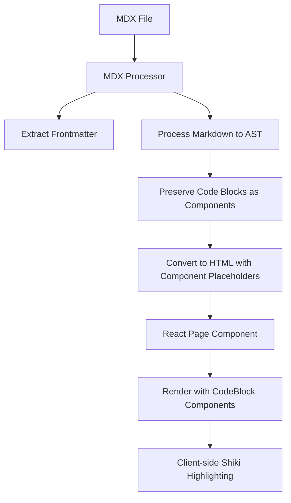

# Design Document

## Overview

The code block rendering issue stems from a conflict between multiple syntax highlighting systems and improper MDX processing. The current architecture has Shiki processing code blocks server-side in the MDX processor, while React components expect to handle code blocks client-side. This creates a mismatch where code blocks are converted to HTML during build time but the React components never receive the code content.

## Architecture

### Current Architecture Issues

1. **Multiple Highlighting Systems**: The project uses Shiki (server-side), custom syntax highlighter (client-side), and has Prism.js as a dependency
2. **Processing Conflict**: MDX processor converts code blocks to HTML during server-side processing, bypassing React components
3. **Component Isolation**: The `CodeBlock` and `MDXCodeBlock` components are not integrated into the MDX rendering pipeline

### Proposed Architecture



## Components and Interfaces

### MDX Processing Pipeline

**Modified MDX Processor**
- Remove server-side Shiki processing from `remarkShikiHighlight`
- Preserve code blocks in their original form for client-side processing
- Maintain frontmatter extraction and TOC generation

**Component Integration**
- Ensure `MDXCodeBlock` component is properly used for code block rendering
- Configure MDX to use custom components for code elements
- Maintain backward compatibility with existing content

### Code Block Component System

**Unified CodeBlock Component**
- Single source of truth for code block rendering
- Client-side Shiki integration for syntax highlighting
- Copy-to-clipboard functionality
- Theme-aware styling
- Language detection and fallback handling

**MDX Integration**
- Proper component mapping for `pre` and `code` elements
- Attribute passing for language, filename, and highlighting options
- Error boundary for graceful failure handling

## Data Models

### Code Block Props Interface

```typescript
interface CodeBlockProps {
  code: string;
  language: string;
  filename?: string;
  highlightLines?: number[];
  showLineNumbers?: boolean;
  tabs?: Array<{ label: string; code: string; language: string }>;
  className?: string;
}
```

### MDX Component Mapping

```typescript
interface MDXComponents {
  pre: (props: { children: React.ReactNode; className?: string }) => JSX.Element;
  code: (props: { children: string; className?: string }) => JSX.Element;
}
```

## Error Handling

### Graceful Degradation Strategy

1. **Syntax Highlighting Failure**: Fall back to plain text with monospace font
2. **Component Loading Error**: Display raw code in basic `<pre><code>` tags
3. **Language Detection Failure**: Use generic text highlighting
4. **Copy Function Failure**: Hide copy button, maintain code display

### Error Boundaries

- Wrap code block components in error boundaries
- Log errors for debugging without breaking page rendering
- Provide user-friendly fallback UI

## Testing Strategy

### Unit Testing

- Test code block component rendering with various languages
- Test copy-to-clipboard functionality
- Test theme switching behavior
- Test error handling and fallback scenarios

### Integration Testing

- Test MDX processing pipeline with code blocks
- Test server-side rendering compatibility
- Test build process with various code block configurations

### Visual Testing

- Test syntax highlighting accuracy across supported languages
- Test responsive behavior and overflow handling
- Test accessibility features (keyboard navigation, screen readers)

### Performance Testing

- Measure code highlighting performance with large code blocks
- Test memory usage with multiple code blocks on a page
- Measure build time impact of processing changes