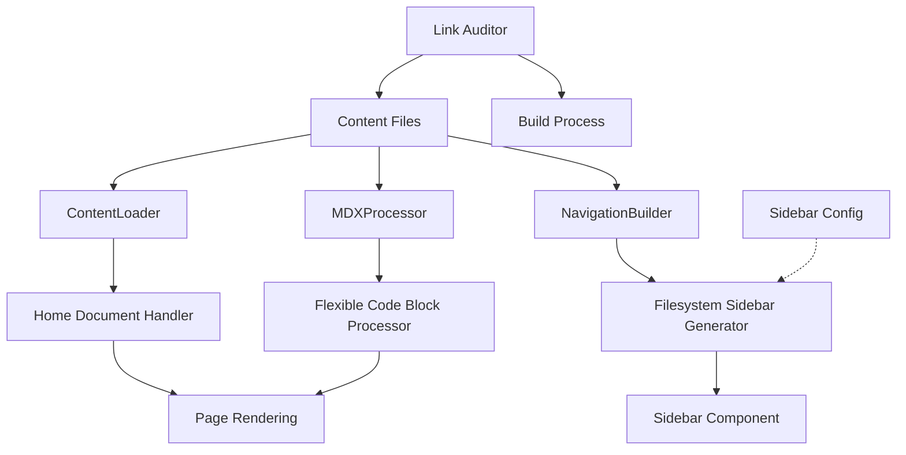

# Design Document

## Overview

This design completes the content processing and rendering system for the multilingual documentation portal. The system builds upon existing implementations in `ContentLoader`, `NavigationBuilder`, and `MDXProcessor` to provide robust home document enforcement, filesystem-based sidebar generation, relaxed code fence requirements, and comprehensive link integrity auditing.

The design follows the existing architecture patterns while addressing gaps in functionality and improving reliability. All components maintain backward compatibility with the current content structure and API.

## Architecture

### System Components



### Data Flow

1. **Content Discovery**: `ContentLoader` scans filesystem for MDX files
2. **Home Document Resolution**: Enhanced routing checks for `index.mdx` files
3. **Navigation Generation**: `NavigationBuilder` creates sidebar from filesystem structure
4. **Content Processing**: `MDXProcessor` handles markdown with relaxed code fence requirements
5. **Link Validation**: `LinkAuditor` validates and fixes internal links
6. **Rendering**: Components render processed content with fallbacks

## Components and Interfaces

### Enhanced ContentLoader

**Purpose**: Extend existing ContentLoader with home document handling

**Key Methods**:
```typescript
class ContentLoader {
  // New methods
  async getHomeDocument(locale: string, version: string): Promise<ContentPage | null>
  async findIndexFile(locale: string, version: string): Promise<string | null>
  generateMissingHomeContent(locale: string, version: string): string
  
  // Enhanced existing methods
  async getContentBySlug(locale: string, version: string, slug: string): Promise<ContentPage | null>
}
```

**Home Document Resolution Logic**:
1. Check for `content/{locale}/{version}/index.mdx`
2. If found, load and return content
3. If missing, return friendly fallback content with guidance
4. Never return 404 for home document requests

### Enhanced NavigationBuilder

**Purpose**: Generate sidebar from filesystem with optional configuration support

**Key Methods**:
```typescript
class NavigationBuilder {
  // New methods
  async buildFilesystemNavigation(locale: string, version: string): Promise<NavigationTree>
  async loadSidebarConfig(locale: string, version: string): Promise<SidebarConfig | null>
  applySidebarConfig(tree: NavigationTree, config: SidebarConfig): NavigationTree
  formatDirectoryName(dirName: string): string
  
  // Enhanced existing methods
  async buildNavigationTree(locale: string, version: string): Promise<NavigationTree>
}
```

**Sidebar Configuration Interface**:
```typescript
interface SidebarConfig {
  order?: string[];           // Custom ordering of items
  hidden?: string[];          // Items to hide from navigation
  labels?: Record<string, string>; // Custom labels for directories
  groups?: Record<string, {
    title: string;
    order?: number;
    collapsed?: boolean;
  }>;
}
```

**Filesystem Scanning Strategy**:
1. Single-pass recursive directory traversal
2. Build navigation tree from actual file structure
3. Apply frontmatter `sidebar_position` for ordering
4. Generate human-friendly labels from directory names
5. Optionally apply sidebar configuration overrides

### Enhanced MDXProcessor

**Purpose**: Process markdown with relaxed code fence requirements

**Key Methods**:
```typescript
class MDXProcessor {
  // New methods
  processCodeBlock(node: any): void
  handleUntypedCodeBlock(code: string): string
  validateCodeBlockContent(code: string): boolean
  
  // Enhanced existing methods
  async processMarkdown(content: string): Promise<ProcessedContent>
}
```

**Code Block Processing Logic**:
1. Detect language specification in code fences
2. For typed blocks (```js), apply syntax highlighting
3. For untyped blocks (```), render with neutral styling
4. Ensure copy button and scroll work for both types
5. Graceful fallback for highlighting failures

### Link Auditor

**Purpose**: New component for comprehensive link validation and fixing

**Interface**:
```typescript
class LinkAuditor {
  async auditAllLinks(locale: string, version: string): Promise<AuditResult>
  async fixBrokenLinks(locale: string, version: string): Promise<FixResult>
  findPlausibleTarget(brokenLink: string, availableFiles: string[]): string | null
  normalizeLink(link: string, locale: string, version: string): string
  validateLinkTarget(link: string, contentMap: Map<string, string>): boolean
}

interface AuditResult {
  totalLinks: number;
  brokenLinks: BrokenLink[];
  fixableLinks: BrokenLink[];
  unfixableLinks: BrokenLink[];
}

interface BrokenLink {
  filePath: string;
  linkText: string;
  originalUrl: string;
  suggestedFix?: string;
  lineNumber?: number;
}
```

**Link Processing Strategy**:
1. Extract all markdown links from content files
2. Validate each link against available content
3. For broken links, attempt to find similar targets
4. Rewrite fixable links automatically
5. Strip unfixable links, preserving text content
6. Generate detailed audit reports

### Home Document Fallback Component

**Purpose**: Render friendly fallback when index.mdx is missing

**Interface**:
```typescript
interface MissingHomeProps {
  locale: string;
  version: string;
  availableContent: string[];
}

function MissingHomePage({ locale, version, availableContent }: MissingHomeProps): JSX.Element
```

**Fallback Content Strategy**:
1. Display friendly "Missing home document" message
2. Provide clear instructions for creating `index.mdx`
3. Show available content in the current locale/version
4. Include links to existing documentation
5. Maintain consistent styling with rest of site

## Data Models

### Enhanced Content Types

```typescript
// Extend existing PageFrontmatter
interface PageFrontmatter {
  title: string;
  description: string;
  version: string;
  locale: string;
  order: number;
  sidebar_position?: number;  // New: explicit sidebar ordering
  sidebar_label?: string;     // New: custom sidebar label
  tags?: string[];
  lastModified?: string;
  deprecated?: boolean;
  redirectFrom?: string[];
}

// New: Sidebar configuration
interface SidebarConfig {
  order?: string[];
  hidden?: string[];
  labels?: Record<string, string>;
  groups?: Record<string, SidebarGroup>;
}

interface SidebarGroup {
  title: string;
  order?: number;
  collapsed?: boolean;
}

// New: Link audit results
interface LinkAuditResult {
  filePath: string;
  totalLinks: number;
  validLinks: number;
  brokenLinks: BrokenLink[];
  fixedLinks: FixedLink[];
}

interface BrokenLink {
  text: string;
  url: string;
  lineNumber: number;
  reason: string;
  suggestedFix?: string;
}

interface FixedLink {
  originalUrl: string;
  newUrl: string;
  reason: string;
}
```

### Enhanced Navigation Types

```typescript
// Extend existing NavigationItem
interface NavigationItem {
  title: string;
  path: string;
  order: number;
  children?: NavigationItem[];
  isExternal?: boolean;
  badge?: 'new' | 'deprecated' | 'beta';
  isDirectory?: boolean;      // New: indicates directory vs file
  originalPath?: string;      // New: original filesystem path
  customLabel?: boolean;      // New: indicates custom vs generated label
}
```

## Error Handling

### Content Loading Errors

1. **Missing Home Document**: Return friendly fallback content instead of 404
2. **Malformed Frontmatter**: Log specific validation errors, continue processing
3. **File System Errors**: Graceful degradation with partial content loading
4. **Processing Timeouts**: Implement reasonable timeouts with progress indicators

### Navigation Building Errors

1. **Empty Directories**: Skip empty directories in navigation
2. **Circular References**: Detect and break circular references in sidebar config
3. **Invalid Configuration**: Validate sidebar config, fall back to filesystem-based navigation
4. **Permission Errors**: Handle filesystem permission issues gracefully

### Code Block Processing Errors

1. **Syntax Highlighting Failures**: Fall back to plain text rendering
2. **Empty Code Blocks**: Display clear "empty code block" message
3. **Invalid Language Specifications**: Treat as untyped blocks
4. **Large Code Blocks**: Implement virtual scrolling for performance

### Link Validation Errors

1. **Network Timeouts**: Skip external link validation during build
2. **File System Changes**: Re-scan content when files are added/removed
3. **Circular Link References**: Detect and report circular references
4. **Malformed URLs**: Sanitize and normalize URLs before validation

## Testing Strategy

### Unit Tests

1. **ContentLoader**: Test home document resolution, fallback generation
2. **NavigationBuilder**: Test filesystem scanning, config application
3. **MDXProcessor**: Test code block processing, untyped block handling
4. **LinkAuditor**: Test link validation, fixing algorithms

### Integration Tests

1. **End-to-End Content Processing**: Full pipeline from filesystem to rendered output
2. **Navigation Generation**: Complete sidebar generation with various content structures
3. **Link Validation**: Full link audit and fixing process
4. **Error Scenarios**: Test all error handling paths

### Performance Tests

1. **Large Content Trees**: Test with 1000+ files
2. **Complex Navigation**: Test deeply nested directory structures
3. **Link Validation**: Test with hundreds of internal links
4. **Memory Usage**: Monitor memory consumption during processing

### Accessibility Tests

1. **Keyboard Navigation**: Test sidebar keyboard navigation
2. **Screen Reader Compatibility**: Test with screen readers
3. **Focus Management**: Test focus indicators and management
4. **Color Contrast**: Verify code block styling meets WCAG standards

## Performance Considerations

### Filesystem Operations

1. **Single-Pass Scanning**: Minimize filesystem I/O with single traversal
2. **Caching**: Cache content and navigation trees between requests
3. **Lazy Loading**: Load content on-demand for large documentation sites
4. **Parallel Processing**: Process multiple files concurrently where safe

### Memory Management

1. **Streaming Processing**: Process large files in chunks
2. **Content Cleanup**: Release processed content from memory after use
3. **Navigation Optimization**: Optimize navigation tree structure for memory efficiency
4. **Link Map Optimization**: Use efficient data structures for link validation

### Build Performance

1. **Incremental Processing**: Only reprocess changed files
2. **Parallel Validation**: Run link validation in parallel with content processing
3. **Progress Indicators**: Provide feedback during long-running operations
4. **Early Termination**: Stop processing on critical errors

## Security Considerations

### Content Validation

1. **Frontmatter Sanitization**: Validate and sanitize all frontmatter fields
2. **Path Traversal Prevention**: Prevent directory traversal attacks in file paths
3. **Content Sanitization**: Sanitize markdown content before processing
4. **Configuration Validation**: Validate sidebar configuration files

### Link Processing

1. **URL Validation**: Validate and sanitize all URLs before processing
2. **External Link Handling**: Safely handle external links without following them
3. **File Path Validation**: Validate file paths to prevent unauthorized access
4. **Content Injection Prevention**: Prevent injection attacks through link text

### Error Information

1. **Error Message Sanitization**: Sanitize error messages to prevent information disclosure
2. **Path Disclosure Prevention**: Avoid exposing internal file paths in errors
3. **Debug Information**: Limit debug information in production builds
4. **Audit Logging**: Log security-relevant events for monitoring