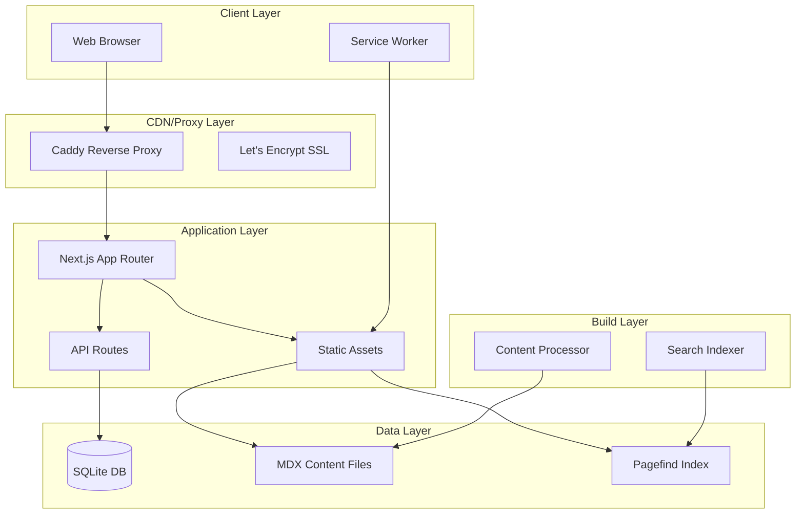
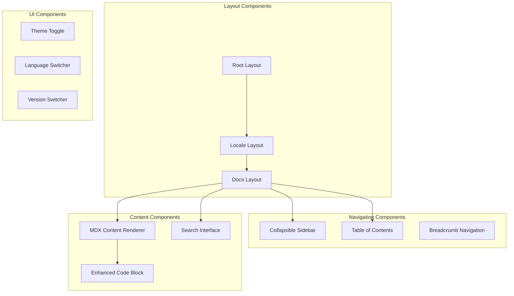

# Design Document

## Overview

The multilingual documentation portal will be built as a high-performance, static-first web application using Next.js 14+ with App Router. The architecture follows a hybrid approach: static content delivery for documentation pages with a lightweight API layer for configuration and analytics. The system prioritizes performance, accessibility, and developer experience while maintaining enterprise-grade UX standards.

### Key Design Principles

- **Static-First**: Content is pre-rendered at build time for maximum performance
- **Database Minimalism**: SQLite stores only configuration/state, never content
- **Progressive Enhancement**: Core functionality works without JavaScript
- **Mobile-First**: Responsive design with touch-friendly interactions
- **Accessibility-First**: WCAG 2.1 AA compliance built into every component

## Architecture

### High-Level Architecture



### Technology Stack

**Frontend Framework**: Next.js 14+ (App Router)

- Static export capability for optimal performance
- Built-in i18n routing for multilingual support
- React Server Components for zero-hydration content
- Excellent SEO and metadata handling

**Database**: better-sqlite3

- Embedded, synchronous, zero-config
- Perfect for configuration and lightweight state
- No network latency, atomic transactions

**Search**: Pagefind

- Static search index built at compile time
- <200KB payload for full-text search
- No server-side queries required

**Styling**: Tailwind CSS + shadcn/ui

- Utility-first CSS for rapid development
- Production-ready component library
- Consistent design system

**Infrastructure**: Docker + Caddy

- Automatic HTTPS with Let's Encrypt
- Security headers and caching
- Zero-downtime deployments

## Components and Interfaces

### Core Components Architecture



### Component Specifications

#### DocsLayout Component

```typescript
interface DocsLayoutProps {
  children: React.ReactNode;
  locale: string;
  version: string;
  navigation: NavigationTree;
  tableOfContents: TOCItem[];
}
```

**Responsibilities:**

- Render three-column layout (sidebar, content, TOC)
- Handle responsive breakpoints
- Manage sidebar collapse state
- Coordinate theme and language switching

#### Sidebar Component

```typescript
interface SidebarProps {
  navigation: NavigationTree;
  currentPath: string;
  locale: string;
  version: string;
  isCollapsed: boolean;
  onToggle: () => void;
}
```

**Features:**

- Multi-level collapsible sections
- Keyboard navigation (arrow keys, Enter, Esc)
- Active page highlighting
- Persistent collapse state in localStorage
- Mobile drawer mode

#### Enhanced Code Block

```typescript
interface CodeBlockProps {
  code: string;
  language: string;
  filename?: string;
  highlightLines?: number[];
  showLineNumbers?: boolean;
  tabs?: Array<{ label: string; code: string; language: string }>;
}
```

**Features:**

- Syntax highlighting with Shiki
- Copy-to-clipboard functionality
- Multi-tab support for request/response examples
- Line highlighting and numbering
- Language badges

#### Search Interface

```typescript
interface SearchProps {
  locale: string;
  version: string;
  placeholder: string;
  shortcuts: string[];
}
```

**Features:**

- Instant search with Pagefind
- Keyboard shortcuts (⌘K/Ctrl+K)
- Result filtering by locale/version
- Highlighted search terms
- Recent searches

### API Layer Design

#### Configuration API

```typescript
// GET /api/config
interface ConfigResponse {
  defaultLocale: string;
  defaultVersion: string;
  availableLocales: string[];
  availableVersions: string[];
  features: Record<string, boolean>;
}
```

#### Health Check API

```typescript
// GET /api/health
interface HealthResponse {
  status: 'healthy' | 'degraded' | 'unhealthy';
  timestamp: string;
  services: {
    database: 'up' | 'down';
    filesystem: 'up' | 'down';
    search: 'up' | 'down';
  };
}
```

## Data Models

### Content Models

#### Page Frontmatter

```typescript
interface PageFrontmatter {
  title: string;
  description: string;
  version: string;
  locale: string;
  order: number;
  tags: string[];
  lastModified?: string;
  deprecated?: boolean;
  redirectFrom?: string[];
}
```

#### Navigation Tree

```typescript
interface NavigationItem {
  title: string;
  path: string;
  order: number;
  children?: NavigationItem[];
  isExternal?: boolean;
  badge?: 'new' | 'deprecated' | 'beta';
}

type NavigationTree = NavigationItem[];
```

#### Table of Contents

```typescript
interface TOCItem {
  id: string;
  title: string;
  level: number; // 2, 3, 4 for h2, h3, h4
  children?: TOCItem[];
}
```

### Database Schema

```sql
-- Configuration table for feature flags and settings
CREATE TABLE config (
  key TEXT PRIMARY KEY,
  value TEXT NOT NULL,
  description TEXT,
  updated_at DATETIME DEFAULT CURRENT_TIMESTAMP
);

-- URL redirects for moved/renamed pages
CREATE TABLE redirects (
  from_path TEXT PRIMARY KEY,
  to_path TEXT NOT NULL,
  status_code INTEGER DEFAULT 301,
  locale TEXT,
  version TEXT,
  created_at DATETIME DEFAULT CURRENT_TIMESTAMP
);

-- Page analytics for popular content tracking
CREATE TABLE page_analytics (
  id INTEGER PRIMARY KEY AUTOINCREMENT,
  path TEXT NOT NULL,
  locale TEXT NOT NULL,
  version TEXT NOT NULL,
  user_agent TEXT,
  referrer TEXT,
  viewed_at DATETIME DEFAULT CURRENT_TIMESTAMP
);

-- Search index metadata
CREATE TABLE search_metadata (
  id INTEGER PRIMARY KEY AUTOINCREMENT,
  index_version TEXT NOT NULL,
  locale TEXT NOT NULL,
  version TEXT NOT NULL,
  page_count INTEGER NOT NULL,
  index_size_bytes INTEGER NOT NULL,
  indexed_at DATETIME DEFAULT CURRENT_TIMESTAMP
);

-- Popular search queries for analytics
CREATE TABLE search_queries (
  id INTEGER PRIMARY KEY AUTOINCREMENT,
  query TEXT NOT NULL,
  locale TEXT NOT NULL,
  version TEXT NOT NULL,
  results_count INTEGER NOT NULL,
  clicked_result_path TEXT,
  searched_at DATETIME DEFAULT CURRENT_TIMESTAMP
);
```

### File System Structure

```
content/
├── en/
│   ├── v1/
│   │   ├── overview.mdx
│   │   ├── authentication.mdx
│   │   ├── api-reference/
│   │   │   ├── users.mdx
│   │   │   └── webhooks.mdx
│   │   └── sdk.mdx
│   └── v2/
│       ├── overview.mdx
│       └── migration-guide.mdx
├── es/
│   └── v1/
│       ├── overview.mdx
│       └── authentication.mdx

        └── authentication.mdx
```

## Error Handling

### Error Boundaries

#### Content Error Boundary

- Catches MDX parsing errors
- Displays fallback UI with error reporting
- Logs errors for debugging

#### Search Error Boundary

- Handles search index loading failures
- Provides fallback to basic text search
- Graceful degradation

### HTTP Error Handling

#### 404 - Page Not Found

- Custom 404 page with navigation
- Suggestions for similar pages
- Language/version-specific fallbacks

#### 500 - Server Error

- Generic error page with retry option
- Error logging to database
- Health check integration

### Client-Side Error Handling

#### Network Failures

- Offline detection with service worker
- Cached content serving
- Retry mechanisms for API calls

#### JavaScript Errors

- Error boundary components
- Graceful degradation to server-rendered content
- User feedback collection

## Testing Strategy

### Unit Testing

#### Content Processing

```typescript
describe('Content Loader', () => {
  test('parses MDX frontmatter correctly');
  test('validates required frontmatter fields');
  test('handles missing files gracefully');
  test('generates correct file-based routes');
});
```

#### Navigation Builder

```typescript
describe('Navigation Builder', () => {
  test('builds hierarchical navigation from content');
  test('sorts items by order and title');
  test('handles missing order values');
  test('filters by locale and version');
});
```

#### Database Operations

```typescript
describe('Database Client', () => {
  test('initializes schema correctly');
  test('handles concurrent reads/writes');
  test('validates data before insertion');
  test('performs migrations safely');
});
```

### Integration Testing

#### API Routes

- Test all API endpoints with various inputs
- Validate response schemas
- Test error conditions and edge cases
- Performance testing for database queries

#### Content Pipeline

- Test MDX processing with various content types
- Validate link checking and reference resolution
- Test build-time optimizations
- Search index generation testing

### End-to-End Testing

#### User Workflows

```typescript
describe('Documentation Navigation', () => {
  test('user can browse documentation hierarchy');
  test('search returns relevant results');
  test('language switching preserves current page');
  test('version switching shows appropriate content');
  test('mobile navigation works correctly');
});
```

#### Performance Testing

- Lighthouse CI integration
- Bundle size monitoring
- Core Web Vitals tracking
- Search performance benchmarks

#### Accessibility Testing

- Automated accessibility scanning
- Keyboard navigation testing
- Screen reader compatibility
- Color contrast validation

### Testing Infrastructure

#### Test Environment Setup

- Docker containers for isolated testing
- Test database with sample data
- Mock content for consistent testing
- CI/CD pipeline integration

#### Performance Monitoring

- Real User Monitoring (RUM)
- Synthetic monitoring for uptime
- Performance budgets enforcement
- Alert thresholds for degradation

## Security Considerations

### Content Security Policy

```
default-src 'self';
script-src 'self' 'unsafe-inline' 'unsafe-eval';
style-src 'self' 'unsafe-inline';
img-src 'self' data: https:;
font-src 'self' data:;
connect-src 'self';
```

### Security Headers (via Caddy)

- Strict-Transport-Security
- X-Content-Type-Options: nosniff
- X-Frame-Options: DENY
- X-XSS-Protection: 1; mode=block
- Referrer-Policy: strict-origin-when-cross-origin

### Input Validation

- Sanitize all user inputs in search queries
- Validate file paths to prevent directory traversal
- Rate limiting on API endpoints
- CSRF protection for admin endpoints

### Deployment Security

- Non-root Docker containers
- Minimal attack surface (Alpine Linux)
- Regular security updates
- Secrets management for SSL certificates
