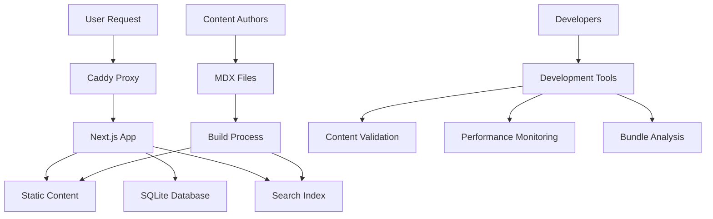

# Multilingual Documentation Portal

A modern, enterprise-grade multilingual documentation portal built with Next.js 16, TypeScript, and Tailwind CSS. Designed for API documentation, developer guides, and knowledge base content with automatic language detection, version management, and static site generation.

## 🌟 Features

- 🌍 **Multilingual Support**: English, Spanish with automatic language detection
- 📚 **API Versioning**: Support for multiple API versions with seamless navigation
- 🔍 **Static Search**: Fast, client-side search with Pagefind integration
- 🎨 **Theme Support**: Dark/Light mode with system preference detection
- 📱 **Responsive Design**: Mobile-first design with enterprise UX
- ♿ **Accessibility**: WCAG 2.1 AA compliant with keyboard navigation
- 🚀 **High Performance**: Lighthouse 95+ scores with optimized static generation
- 🔧 **Developer Tools**: Content validation, performance monitoring, and build optimization
- 📊 **Analytics**: Search analytics and content performance tracking
- 🐳 **Docker Ready**: Complete containerization with SSL and reverse proxy

## 🛠 Tech Stack

- Framework**: Next.js 16 with App Router and Turbopack
- Language**: TypeScript (strict mode)
- Styling**: Tailwind CSS + shadcn/ui components
- Database**: SQLite with better-sqlite3
- Search**: Pagefind for static search indexing
- Content**: MDX with frontmatter for structured content
- Deployment**: Docker + Caddy with automatic SSL
- Monitoring**: Built-in health checks and performance monitoring

---

## 🚀 Quick Start

### Prerequisites

- Node.js 18+ (recommended: 20+)
- npm or yarn
- Docker and Docker Compose (for production deployment)

### Local Development

1. **Clone and install dependencies:**
   ```bash
   git clone <repository-url>
   cd multilingual-docs-portal
   npm install
   ```

2. **Start the enhanced development server:**
   ```bash
   npm run dev:enhanced
   ```
   
   Or use the standard Next.js dev server:
   ```bash
   npm run dev
   ```

3. **Open your browser:**
   - Local: http://localhost:3000
   - The app will automatically redirect to your preferred language

### Production Build

```bash
# Build with optimization and performance analysis
npm run build:production

# Or standard build
npm run build

# Serve the static build
npx serve out
```

---

## 📝 Content Creation Guide

### Content Structure

The documentation content is organized in a hierarchical structure:

```
content/
├── en/                     # English content
│   └── v1/                # Version 1
│       ├── overview.mdx   # API overview
│       ├── authentication.mdx
│       ├── guides/        # Tutorial guides
│       │   └── getting-started.mdx
│       └── api-reference/ # API documentation
│           ├── users.mdx
│           └── webhooks.mdx
├── es/                     # Spanish content
│   └── v1/                # Same structure as English
│       ├── overview.mdx
│       └── ...

```

### Creating New Content

#### Using the Content Authoring Tool

The easiest way to create new content is using the built-in authoring tool:

```bash
# Create a new guide
npm run content:create en v1 guide "API Integration Guide"

# Create API reference documentation
npm run content:create en v1 api-reference "Webhooks API"

# Create an overview page
npm run content:create es v1 overview "Descripción General"
```

#### Manual Content Creation

1. **Create the MDX file** in the appropriate directory:
   ```bash
   mkdir -p content/en/v1/guides
   touch content/en/v1/guides/my-new-guide.mdx
   ```

2. **Add frontmatter** (required for all content):
   ```yaml
   ---
   title: "My New Guide"
   description: "A comprehensive guide to using our API"
   version: "v1"
   locale: "en"
   order: 3
   tags: ["guide", "tutorial", "api"]
   lastModified: "2024-01-20"
   ---
   ```

3. **Write your content** using MDX syntax:
   ```markdown
   # My New Guide
   
   Welcome to this comprehensive guide...
   
   ## Getting Started
   
   First, you'll need to...
   
   ```javascript
   const response = await fetch('/api/endpoint');
   ```
   ```

### Frontmatter Reference

| Field | Type | Required | Description |
|-------|------|----------|-------------|
| `title` | string | ✅ | Page title (used in navigation and SEO) |
| `description` | string | ✅ | Brief description for SEO and previews |
| `version` | string | ✅ | API version (e.g., "v1", "v2") |
| `locale` | string | ✅ | Language code ("en", "es") |
| `order` | number | ✅ | Sort order in navigation |
| `tags` | string[] | ✅ | Tags for categorization and search |
| `lastModified` | string | ❌ | Last update date (ISO format) |
| `deprecated` | boolean | ❌ | Mark content as deprecated |
| `redirectFrom` | string[] | ❌ | Previous URLs that should redirect here |

### Content Best Practices

#### Writing Style
- Use active voice and clear, concise language
- Include practical code examples in multiple languages
- Structure content with clear headings and sections
- Add step-by-step instructions for complex procedures

#### Code Examples
Always specify the language for syntax highlighting:

````markdown
```javascript
const client = new APIClient({
  apiKey: 'your-api-key'
});
```

```python
client = APIClient(api_key='your-api-key')
```

```bash
curl -H "Authorization: Bearer your-api-key" \
  https://api.example.com/v1/users
```
````

#### Linking Between Documents
Use absolute paths for internal links:

```markdown
- [Authentication Guide](/docs/authentication)
- [Users API Reference](/docs/api-reference/users)
- [Getting Started](/docs/guides/getting-started)
```

### Content Validation

Validate your content before publishing:

```bash
# Validate all content
npm run validate:content

# Lint content for style and consistency
npm run lint:content

# Generate detailed linting report
npm run lint:content:report
```

---

## 🌍 Language Management

### Supported Languages

| Language | Code | Native Name | Status |
|----------|------|-------------|--------|
| English | `en` | English | ✅ Primary |
| Spanish | `es` | Español | ✅ Active |

### Adding a New Language

1. **Update locale configuration** in `lib/locale-config.ts`:
   ```typescript
   export const locales = ['en', 'es', 'fr'] as const; // Add 'fr'
   
   export const localeConfig = {
     // ... existing locales
     fr: {
       name: 'French',
       nativeName: 'Français',
       direction: 'ltr',
     },
   } as const;
   ```

2. **Create content directory structure:**
   ```bash
   mkdir -p content/fr/v1/{guides,api-reference}
   ```

3. **Generate translation templates:**
   ```bash
   # Generate French translation from English content
   npm run content:translate content/en/v1/overview.mdx fr
   npm run content:translate content/en/v1/authentication.mdx fr
   ```

4. **Translate the content** and update frontmatter:
   - Update `title` and `description` fields
   - Change `locale` to the new language code
   - Translate all content while preserving code examples

5. **Test the new language:**
   ```bash
   npm run dev
   # Navigate to http://localhost:3000/fr
   ```

### Translation Workflow

1. **Create content in English first** (primary language)
2. **Generate translation templates:**
   ```bash
   npm run content:translate content/en/v1/guides/getting-started.mdx es
   ```
3. **Translate content** while preserving:
   - Code examples and syntax
   - API endpoint URLs
   - Technical terminology consistency
4. **Validate translations:**
   ```bash
   npm run content:validate
   ```

### Language Detection

The system automatically detects user language preference from:
1. URL path (`/es/docs/...`)
2. Browser `Accept-Language` header
3. Stored user preference (localStorage)
4. Falls back to English as default

---

## 📚 Topic & Theme Creation

### Creating New Documentation Topics

1. **Plan your topic structure:**
   ```
   Topic: "Webhooks"
   ├── Overview (webhooks.mdx)
   ├── Setup Guide (guides/webhook-setup.mdx)
   └── API Reference (api-reference/webhooks.mdx)
   ```

2. **Create content files:**
   ```bash
   # Create main topic page
   npm run content:create en v1 api-reference "Webhooks API"
   
   # Create supporting guide
   npm run content:create en v1 guide "Webhook Setup Guide"
   ```

3. **Update navigation** (automatic based on frontmatter):
   - The system automatically builds navigation from content structure
   - Use `order` field in frontmatter to control positioning
   - Use `tags` to group related content

### Navigation Structure

Navigation is automatically generated from:
- File structure**: Directory hierarchy determines grouping
- Frontmatter**: `order` field determines sort order
- Content type**: Guides, API references, and overviews are grouped separately

Example navigation configuration:
```yaml
# In your MDX frontmatter
---
title: "Users API"
order: 1          # First in API Reference section
tags: ["api", "users", "crud"]
---
```

### Sidebar Navigation

The sidebar automatically organizes content by:
1. **Locale** (language-specific navigation)
2. **Version** (v1, v2, etc.)
3. **Content Type** (Overview → Guides → API Reference)
4. **Order** (specified in frontmatter)

---

## ⚙️ Operational Manual

### Configuration Management

#### Environment Variables

Create a `.env.local` file for local development:

| Variable | Description | Default | Required |
|----------|-------------|---------|----------|
| `NEXT_PUBLIC_BASE_URL` | Base URL for the application | `http://localhost:3000` | ❌ |
| `DATABASE_URL` | SQLite database path | `./data/app.db` | ❌ |
| `NODE_ENV` | Environment mode | `development` | ❌ |
| `ANALYZE` | Enable bundle analyzer | `false` | ❌ |

#### Database Configuration

The system uses SQLite for storing:
- Redirect rules
- Search analytics
- Configuration settings
- Content metadata

**Initialize database:**
```bash
npm run db:init
```

**Run migrations:**
```bash
npm run db:migrate
```

**Check database health:**
```bash
npm run db:health
```

### Content Index Management

#### Search Index

The search functionality uses Pagefind for static search indexing:

```bash
# Build search index
npm run search:build

# Clean up search data
npm run search:cleanup
```

#### Rebuilding Indexes

When content changes, rebuild the search index:

```bash
# Full rebuild (recommended after major content changes)
npm run build:production

# Quick index rebuild
npm run search:build
```

### Health Checks

Monitor system health with built-in endpoints:

```bash
# Check application health
curl http://localhost:3000/api/health

# Check database connectivity
npm run db:health

# Validate all content
npm run validate:content
```

### Backup and Restore

#### Database Backup
```bash
# Create backup
cp data/app.db data/app.db.backup.$(date +%Y%m%d_%H%M%S)

# Restore from backup
cp data/app.db.backup.20240120_143000 data/app.db
```

#### Content Backup
```bash
# Backup all content
tar -czf content-backup-$(date +%Y%m%d).tar.gz content/

# Restore content
tar -xzf content-backup-20240120.tar.gz
```

---

## 🐳 Deployment Instructions

### Local Development

```bash
# Standard development
npm run dev

# Enhanced development with content watching
npm run dev:enhanced

# Development with performance monitoring
npm run dev:enhanced --verbose
```

### Docker Development

```bash
# Build and run with Docker Compose
docker-compose -f docker-compose.dev.yml up --build

# Run in background
docker-compose -f docker-compose.dev.yml up -d
```

### Production Deployment

#### Using Docker Compose (Recommended)

1. **Prepare environment:**
   ```bash
   # Copy environment template
   cp .env.example .env.production
   
   # Edit production variables
   nano .env.production
   ```

2. **Deploy with SSL:**
   ```bash
   # Build and deploy
   docker-compose -f docker-compose.prod.yml up -d
   
   # Check logs
   docker-compose -f docker-compose.prod.yml logs -f
   ```

#### Service Architecture

| Service | Purpose | Port | Health Check |
|---------|---------|------|--------------|
| **web** | Next.js application | 3000 | `/api/health` |
| **proxy** | Caddy reverse proxy | 80, 443 | Built-in |
| **certbot** | SSL certificate management | - | Automatic |

#### Environment Configuration

**Production `.env` file:**
```bash
# Application
NEXT_PUBLIC_BASE_URL=https://docs.yourcompany.com
NODE_ENV=production

# Database
DATABASE_URL=./data/app.db

# SSL (for Caddy)
DOMAIN=docs.yourcompany.com
EMAIL=admin@yourcompany.com

# Optional: Analytics
ANALYTICS_ENABLED=true
```

#### SSL Certificate Management

SSL certificates are automatically managed by Caddy:

- Automatic issuance** via Let's Encrypt
- Auto-renewal** before expiration
- HTTP to HTTPS** redirect
- Security headers** included

**Manual certificate operations:**
```bash
# Check certificate status
docker-compose exec proxy caddy list-certificates

# Force certificate renewal
docker-compose exec proxy caddy reload --config /etc/caddy/Caddyfile
```

### Build Optimization

#### Performance Analysis

```bash
# Analyze bundle sizes
npm run performance:analyze

# Build with bundle analyzer
npm run build:analyze

# Generate Lighthouse report
npm run performance:lighthouse
```

#### Build Scripts

| Script | Purpose | Use Case |
|--------|---------|----------|
| `npm run build` | Standard build | Development testing |
| `npm run build:optimized` | Optimized build with analysis | Pre-production |
| `npm run build:production` | Full production build | Production deployment |
| `npm run build:analyze` | Build with bundle analyzer | Performance debugging |

---

## 📖 Content Versioning

### Adding a New API Version

1. **Create version directory structure:**
   ```bash
   # Create v2 directories for all languages
   mkdir -p content/{en,es}/v2/{guides,api-reference}
   ```

2. **Copy and update content from previous version:**
   ```bash
   # Copy English v1 content to v2
   cp -r content/en/v1/* content/en/v2/
   
   # Update frontmatter in all v2 files
   find content/en/v2 -name "*.mdx" -exec sed -i 's/version: "v1"/version: "v2"/g' {} \;
   ```

3. **Update version-specific content:**
   - Modify API endpoints and examples
   - Update code samples for new version
   - Add migration guides from previous version

4. **Test the new version:**
   ```bash
   npm run dev
   # Navigate to http://localhost:3000/en/docs/v2
   ```

### Version Management

#### URL Structure
- Current version**: `/en/docs/authentication`
- Specific version**: `/en/docs/v1/authentication`
- Version selector**: Automatically appears when multiple versions exist

#### Deprecation Workflow

1. **Mark content as deprecated:**
   ```yaml
   ---
   title: "Legacy Users API"
   deprecated: true
   redirectFrom: ["/docs/old-users-api"]
   ---
   ```

2. **Add deprecation notice:**
   ```markdown
   > ⚠️ **Deprecated**: This API version is deprecated. Please migrate to [Users API v2](/docs/api-reference/users-v2).
   ```

3. **Set up redirects** in the database or configuration

### Content Lifecycle

1. **Draft** → Create content with `draft: true` in frontmatter
2. **Review** → Validate content with `npm run lint:content`
3. **Publish** → Remove draft flag and deploy
4. **Update** → Modify content and update `lastModified` date
5. **Deprecate** → Add deprecation warnings and redirect rules
6. **Archive** → Move to archived version or remove

---

## 🔍 Search Index Management

### Search Architecture

The search system uses Pagefind for static, client-side search:

- Index Generation**: Build-time indexing of all content
- Multi-language**: Separate indexes per language
- Performance**: Fast, client-side search with no server required
- Analytics**: Track search queries and popular content

### Managing Search Indexes

#### Building Indexes

```bash
# Build search index for all languages
npm run search:build

# Clean up old search data
npm run search:cleanup

# Full rebuild (content + search + sitemap)
npm run build:full
```

#### Search Configuration

Search behavior is configured in `lib/search-indexer.ts`:

```typescript
const searchConfig = {
  languages: ['en', 'es'],
  indexFields: ['title', 'description', 'content'],
  excludeSelectors: ['.no-search', 'nav', 'footer'],
  boostFields: {
    title: 3,
    description: 2,
    headings: 1.5
  }
};
```

#### Search Analytics

Track search performance:

```bash
# View search analytics
curl http://localhost:3000/api/search/analytics

# Get popular searches
curl http://localhost:3000/api/search/popular
```

---

## 👥 Contributor Guide

### Development Workflow

1. **Fork and clone** the repository
2. **Create a feature branch:**
   ```bash
   git checkout -b feature/new-documentation-section
   ```
3. **Make your changes** following the guidelines below
4. **Test your changes:**
   ```bash
   npm run validate:content
   npm run lint:content
   npm run build
   ```
5. **Submit a pull request** with clear description

### Code Contribution Guidelines

#### TypeScript Standards
- Use strict TypeScript configuration
- Provide proper type definitions
- Avoid `any` types
- Use meaningful variable and function names

#### Component Guidelines
- Follow React best practices
- Use TypeScript for all components
- Implement proper accessibility attributes
- Include JSDoc comments for complex components

#### Testing Requirements
- Validate content changes with built-in tools
- Test across all supported languages
- Verify responsive design on multiple screen sizes
- Check accessibility with keyboard navigation

### Content Contribution Guidelines

#### Writing Standards
- Tone**: Professional but approachable
- Structure**: Use clear headings and logical flow
- Examples**: Include practical, working code examples
- Consistency**: Follow established terminology and formatting

#### Documentation Standards
- Completeness**: Cover all parameters, responses, and edge cases
- Accuracy**: Test all code examples before publishing
- Clarity**: Write for developers of varying experience levels
- Maintenance**: Keep content up-to-date with API changes

#### Review Process
1. **Content validation** passes all checks
2. **Peer review** by team member
3. **Technical accuracy** verified
4. **Language consistency** across translations

---

## 🎨 Visual & UX Customization

### Theme Customization

#### Colors and Typography

Customize the design system in `app/globals.css`:

```css
:root {
  --background: 0 0% 100%;
  --foreground: 222.2 84% 4.9%;
  --primary: 222.2 47.4% 11.2%;
  --primary-foreground: 210 40% 98%;
  /* Add your custom colors */
}
```

#### Component Styling

Components use Tailwind CSS with CSS variables:

```typescript
// Example: Custom button variant
const buttonVariants = cva(
  "inline-flex items-center justify-center rounded-md text-sm font-medium",
  {
    variants: {
      variant: {
        default: "bg-primary text-primary-foreground hover:bg-primary/90",
        // Add custom variants
      }
    }
  }
);
```

### Brand Assets

#### Logo and Icons

Store brand assets in the `public/` directory:

```
public/
├── logo.svg           # Main logo
├── logo-dark.svg      # Dark theme logo
├── favicon.ico        # Favicon (auto-generated)
├── og-image.png       # Social media preview
└── icons/
    ├── api.svg        # Topic icons
    ├── guide.svg
    └── reference.svg
```

#### Updating Brand Assets

1. **Replace logo files** in `public/`
2. **Update metadata** in `app/layout.tsx`:
   ```typescript
   export const metadata: Metadata = {
     title: 'Your Company Docs',
     description: 'Your company API documentation',
     // Update other metadata
   };
   ```
3. **Customize theme colors** in `app/globals.css`
4. **Rebuild and test:**
   ```bash
   npm run build
   ```

### Layout Customization

#### Header and Navigation

Customize the main navigation in `components/docs-layout.tsx`:

```typescript
const navigationSections = [
  { title: 'Overview', href: '/docs/overview' },
  { title: 'Guides', href: '/docs/guides' },
  { title: 'API Reference', href: '/docs/api-reference' },
  // Add custom sections
];
```

#### Footer

Update footer content in the layout components:

```typescript
const footerLinks = {
  product: [
    { title: 'Documentation', href: '/docs' },
    { title: 'API Status', href: '/status' },
  ],
  company: [
    { title: 'About', href: '/about' },
    { title: 'Contact', href: '/contact' },
  ],
};
```

---

## 🔧 Development Tools

### Available Scripts

#### Core Development
```bash
npm run dev                    # Standard Next.js dev server
npm run dev:enhanced           # Enhanced dev server with content watching
npm run build                  # Production build
npm run build:optimized        # Build with performance analysis
npm run build:production       # Full production build with reports
```

#### Content Management
```bash
npm run content:create         # Create new content files
npm run content:list           # List all content files
npm run content:validate       # Validate content structure
npm run content:translate      # Generate translation templates
npm run content:watch          # Watch content files for changes
```

#### Quality Assurance
```bash
npm run lint                   # Lint TypeScript/JavaScript
npm run lint:content           # Lint content files
npm run lint:content:report    # Generate content linting report
npm run validate:content       # Validate content structure and links
npm run type-check             # TypeScript type checking
```

#### Performance & Analysis
```bash
npm run performance:analyze    # Analyze bundle sizes
npm run performance:build      # Build with performance monitoring
npm run performance:lighthouse # Generate Lighthouse report
npm run build:analyze          # Build with webpack bundle analyzer
```

### Development Workflow

1. **Start enhanced development server:**
   ```bash
   npm run dev:enhanced
   ```

2. **Create new content:**
   ```bash
   npm run content:create en v1 guide "New Feature Guide"
   ```

3. **Validate changes:**
   ```bash
   npm run validate:content
   npm run lint:content
   ```

4. **Test build:**
   ```bash
   npm run build:optimized
   ```

### Performance Monitoring

#### Bundle Analysis

Monitor bundle sizes and performance:

```bash
# Analyze current build
npm run performance:analyze

# Build with bundle analyzer (opens in browser)
npm run build:analyze
```

#### Performance Budgets

The system enforces performance budgets:
- JavaScript bundle**: < 300KB
- CSS bundle**: < 50KB  
- Total bundle (gzipped)**: < 500KB
- Lighthouse score**: > 95

---

## 🚨 Troubleshooting

### Common Issues

#### Build Failures

**Issue**: TypeScript compilation errors
```bash
# Solution: Check types and fix errors
npm run type-check
```

**Issue**: Content validation failures
```bash
# Solution: Validate and fix content
npm run validate:content
npm run lint:content
```

#### Development Server Issues

**Issue**: Port already in use
```bash
# Solution: Use different port
npm run dev:enhanced -- --port 3001
```

**Issue**: Content not updating
```bash
# Solution: Clear Next.js cache
rm -rf .next
npm run dev
```

#### Search Not Working

**Issue**: Search returns no results
```bash
# Solution: Rebuild search index
npm run search:build
npm run build:full
```

### Debug Commands

```bash
# Check all systems
npm run db:health
npm run validate:content
npm run type-check

# Analyze performance
npm run performance:analyze

# Generate development report
npm run dev:enhanced --help
```

### Log Analysis

#### Application Logs
```bash
# Docker logs
docker-compose logs -f web

# Development logs
npm run dev:enhanced --verbose
```

#### Error Tracking
- Check browser console for client-side errors
- Monitor server logs for API issues
- Use performance tools for optimization insights

---

## 📋 Maintenance Checklist

### Daily Tasks
- [ ] Monitor application health (`/api/health`)
- [ ] Check error logs for issues
- [ ] Verify search functionality

### Weekly Tasks
- [ ] Review content analytics
- [ ] Check SSL certificate status
- [ ] Update dependencies if needed
- [ ] Backup database and content

### Monthly Tasks
- [ ] Performance audit with Lighthouse
- [ ] Content audit for outdated information
- [ ] Security updates and patches
- [ ] Review and optimize bundle sizes

### Quarterly Tasks
- [ ] Major dependency updates
- [ ] Content strategy review
- [ ] User feedback analysis
- [ ] Infrastructure optimization

### SSL Certificate Management

Certificates are automatically managed by Caddy, but you can monitor them:

```bash
# Check certificate status
docker-compose exec proxy caddy list-certificates

# View certificate details
openssl s_client -connect yourdomain.com:443 -servername yourdomain.com

# Force renewal (if needed)
docker-compose exec proxy caddy reload
```

---

## 📊 Monitoring & Analytics

### Performance Monitoring

#### Built-in Metrics
- Bundle size analysis
- Build time tracking
- Lighthouse performance scores
- Core Web Vitals monitoring

#### Custom Monitoring

```bash
# Generate performance report
npm run performance:build

# Monitor build times
npm run build:optimized --verbose
```

### Content Analytics

Track content performance:
- Search query analytics
- Popular content identification
- User navigation patterns
- Content engagement metrics

Access analytics via:
```bash
curl http://localhost:3000/api/search/analytics
```

---

## 🔗 API Reference

### Health Check Endpoint

```bash
GET /api/health
```

Response:
```json
{
  "status": "healthy",
  "timestamp": "2024-01-20T15:30:00Z",
  "services": {
    "database": "up",
    "search": "up"
  }
}
```

### Configuration Endpoint

```bash
GET /api/config
```

Response:
```json
{
  "locales": ["en", "es"],
  "versions": ["v1"],
  "features": {
    "search": true,
    "analytics": true
  }
}
```

---

## 🤝 Support & Resources

### Documentation
- [Development Guide](DEVELOPMENT.md) - Detailed development workflow
- [Docker Deployment Guide](DOCKER_DEPLOYMENT.md) - Container deployment
- [API Endpoints](docs/api-endpoints.md) - Internal API reference

### Community
- Issues**: Report bugs and request features via GitHub Issues
- Discussions**: Join community discussions for questions and ideas
- Contributing**: See our [Contributing Guidelines](CONTRIBUTING.md)

### Commercial Support & Licensing

For commercial licensing, enterprise support, or custom development:

**Validme LLC**  
📧 Email: [contacto@validme.tech](mailto:contacto@validme.tech)  
🌐 Website: [https://validme.tech](https://validme.tech)  
📍 Address: 254 Chapman Rd, Ste 208#19266, Newark, Delaware 19702, US

### External Resources
- [Next.js Documentation](https://nextjs.org/docs)
- [MDX Documentation](https://mdxjs.com/)
- [Tailwind CSS Documentation](https://tailwindcss.com/docs)
- [Pagefind Documentation](https://pagefind.app/)

---

## 🤝 Contributing

We welcome contributions from the community! Please read our [Contributing Guidelines](CONTRIBUTING.md) to get started.

### Quick Contribution Steps

1. Fork the repository
2. Create a feature branch
3. Make your changes following our guidelines
4. Submit a pull request

For detailed information about:
- Development setup and workflow
- Code style and standards  
- Content creation guidelines
- Legal requirements and licensing

Please see our [CONTRIBUTING.md](CONTRIBUTING.md) file.

## 📄 License

This project is licensed under **Commons Clause + Apache 2.0**. See the [LICENSE](LICENSE) file for complete details.

### License Summary

- ✅ **Use, modify, and distribute** for non-commercial purposes
- ✅ **Create derivative works** and contribute improvements  
- ✅ **Use for internal business** purposes
- ❌ **Cannot sell** the software or offer as commercial service
- ❌ **Cannot charge fees** for hosting, consulting, or support services

For commercial licensing inquiries, please contact us.

---

## 🏗 Architecture Overview



### Key Components

- Content Layer**: MDX files with frontmatter metadata
- Application Layer**: Next.js with TypeScript and React
- Data Layer**: SQLite for configuration and analytics
- Search Layer**: Pagefind for static search indexing
- Deployment Layer**: Docker with Caddy proxy and SSL

---

*Built with ❤️ for developers and content creators*